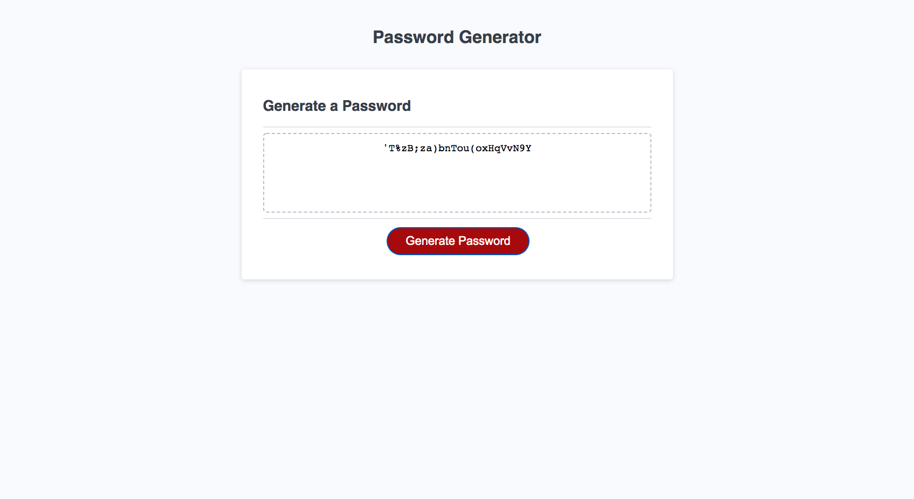

# Password Generator Assignment

## Description

The motivation for this project was to build something that would make me safe and secure passwords with the click of a couple of buttons. I built this project so that I can make passwords for my accounts as well as let other users make passwords for themselves so that they can keep their information secure. Other than for users sake, I made and commented the code to the best of my ability to showcase my JavaScript skills. The problems this program solves is, that it can make very complex passwords in the matter of seconds so, you don't have to come up with one on your own. You can also customize it to the amount characters and what characters need to be in the password itself. From developing this project something I have learned is that you have to take into account every user error and input that can happen and you must create conditions if those events take place. 

## Features

Some of the features that I have added to make sure my password generator is efficient are:

* I have let the user have the choice to input 8-128 characters for their password length 

* I made parameters to only let users input whole numbers in range for the input

* Added options of 4 different character types to be in the password: Uppercase, Lowercase, Numbers and Symbols

* I did not leave password generation all up to fate, I added parameters to ensure that if a character is chosen at least one of the chosen character type will be present in the password. 

## Usage

The way this project should be used by others is to first press the "generate password" button. The browser will prompt you to select the size of your password (between 8 - 128 characters). It will then tell you to confirm the four parameters you want, if you want the expressed characters, you press okay, otherwise hit cancel. A final confirmation will pop up showing the confirmation of all the parameters you have chosen and will ask you if the parameters are correct. If you hit okay you will have a password generated in the text box below, otherwise, the program will close and you can press the generate password button again to start over.

## Demo

This is what the following webpage looks like:

## Wire Frame

No wire frame was needed as it was only JavaScript code written

## Deployed Application

Check out the live page at: https://keysbhag.github.io/Module3Challenge/

## Credits

Keyshawn Bhagwandin https://github.com/keysbhag/Module3Challenge

## Tests

Try to break my code if you can:

* Type text, symbols, negative integers, decimal numbers or whatever else you can think of!

* Try all different selections of password generations!

## License
N/A

---
© 2022 Keysbhag. Confidential and Proprietary. All Rights Reserved.
